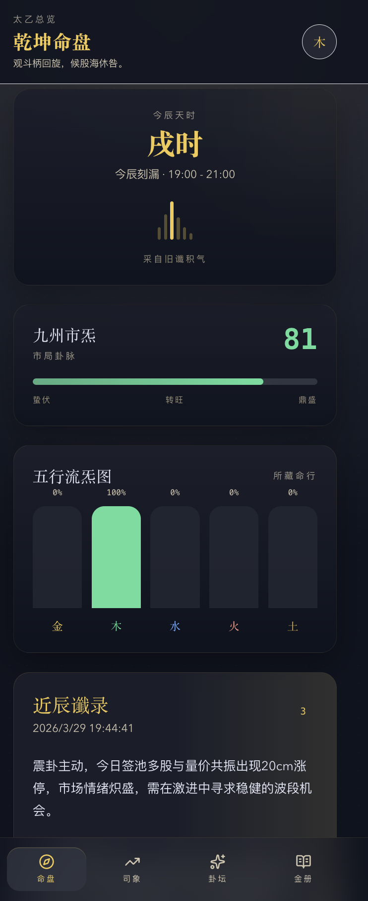
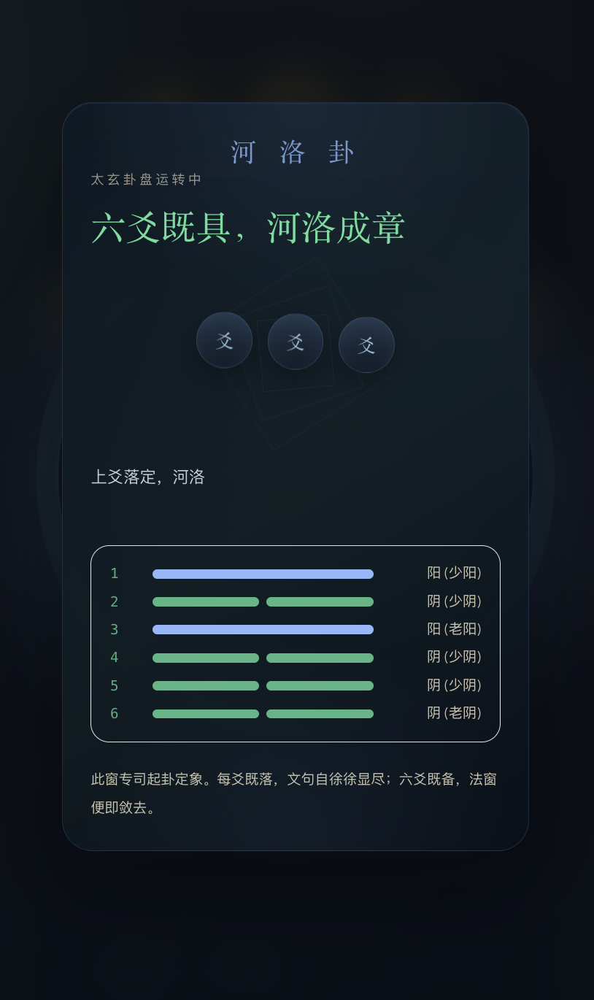
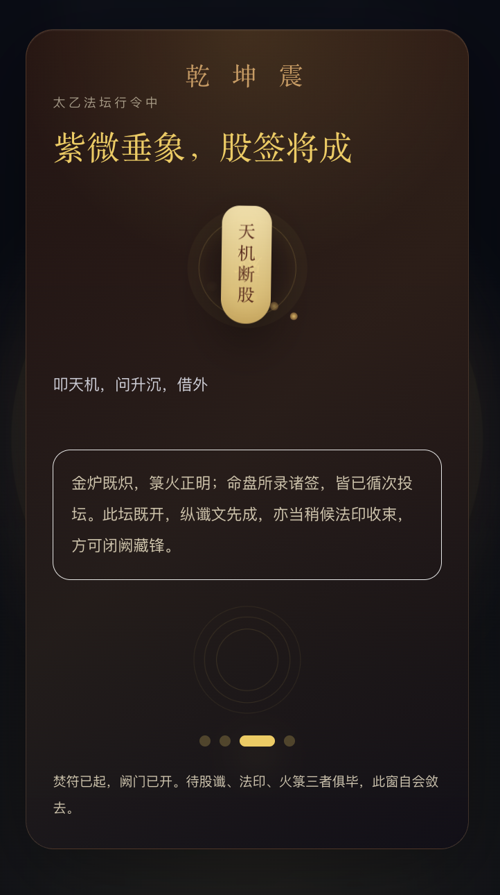

<div align="center">

# 🔮 玄学荐股 · Mystic Stocks

**当五行八卦遇上 A 股市场，用玄学的力量为你指引投资方向**

[](https://nextjs.org/)
[](https://react.dev/)
[](https://www.typescriptlang.org/)
[](https://tailwindcss.com/)
[](LICENSE)

</div>

---

## ✨ 项目简介

玄学荐股是一款将中国传统易学文化（五行、六爻、八卦）与 A 股市场数据相结合的创新 Web 应用。用户通过"摇卦"仪式，借助 AI 大模型推演生成个性化的股票推荐结果——**纯属娱乐，不构成投资建议**。

## 📸 应用截图

<div align="center">

| 乾坤首页 | 个股市道 |
|:---:|:---:|
|  |  |

| 卜卦仪式 | AI 推演结果 |
|:---:|:---:|
|  |  |

| 荐股工作台 | 帐籍记录 |
|:---:|:---:|
|  |  |

</div>

## 🎯 核心功能

- 🀄 **六爻摇卦** — 真实的六爻生成算法，推演本卦、互卦、变卦
- 🤖 **AI 推演荐股** — 接入智谱 BigModel，基于卦象自动生成结构化荐股结论
- 📈 **五行可视化** — 金木水火土五维雷达图、K 线气运图、阴阳饼图
- 💹 **个股市道** — 实时行情数据展示，涨跌与五行属性联动
- 📒 **帐籍管理** — 本地保存推荐记录，支持加入/移除自选
- 📱 **移动优先** — 针对手机端深度优化，丝滑触控体验

## 🛠 技术栈

| 类别 | 技术 |
|------|------|
| 框架 | Next.js 16 (App Router) |
| 语言 | TypeScript 5.9 |
| UI | React 19 + Tailwind CSS 3 |
| AI | 智谱 BigModel GLM-4 |
| 包管理 | pnpm 10 |
| 部署 | Node.js 生产构建 |

## 🚀 快速开始

### 环境要求

- Node.js >= 18
- pnpm >= 8

### 安装与运行

```bash
# 克隆项目
git clone https://github.com/arvinlvc/mystic-stocks.git
cd mystic-stocks

# 安装依赖
pnpm install

# 配置环境变量
cp .env.example .env.local
# 编辑 .env.local 填入你的 BigModel API Key

# 启动开发服务器
pnpm dev
```

### 生产构建

```bash
pnpm build
pnpm start
```

## ⚙️ 环境变量

| 变量 | 说明 | 示例 |
|------|------|------|
| `BIGMODEL_API_KEY` | 智谱 BigModel API 密钥 | `your_api_key_here` |
| `BIGMODEL_BASE_URL` | API 地址 | `https://open.bigmodel.cn/api/coding/paas/v4` |
| `BIGMODEL_MODEL` | 模型名称 | `glm-4.7` |

## 📡 API 接口

| 方法 | 路径 | 说明 |
|------|------|------|
| `POST` | `/api/recommend` | 调用 BigModel 返回结构化荐股结果 |
| `GET` | `/api/state` | 获取本地历史记录与帐籍 |
| `POST` | `/api/watchlist` | 将推荐标的加入帐籍 |
| `DELETE` | `/api/watchlist` | 从帐籍移除标的 |

## 📁 项目结构

```
├── app/                    # Next.js App Router
│   ├── api/                # API 路由 (recommend, state, watchlist)
│   ├── divination/         # 卜卦页
│   ├── ledger/             # 帐籍页
│   ├── market/             # 市道页
│   └── page.tsx            # 乾坤首页
├── components/             # 组件库
│   ├── charts/             # 五行图表组件
│   ├── divination/         # 卜卦相关组件
│   ├── layout/             # 布局与导航
│   └── watchlist/          # 帐籍操作组件
├── lib/                    # 核心逻辑
│   ├── bigmodel.ts         # BigModel API 调用
│   ├── divination-*.ts     # 六爻算法与卦象推演
│   ├── live-*.ts           # 实时行情数据
│   └── recommendation-*.ts # 荐股类型与默认值
├── image/                  # 应用截图
└── stitch/                 # 设计原型与文档
```

## ⚠️ 免责声明

本项目仅供学习交流与娱乐用途，**不构成任何投资建议**。股市有风险，投资需谨慎。玄学荐股结果由 AI 模型基于卦象生成，不具有任何实际预测能力。

## 📄 License

[MIT](LICENSE)
